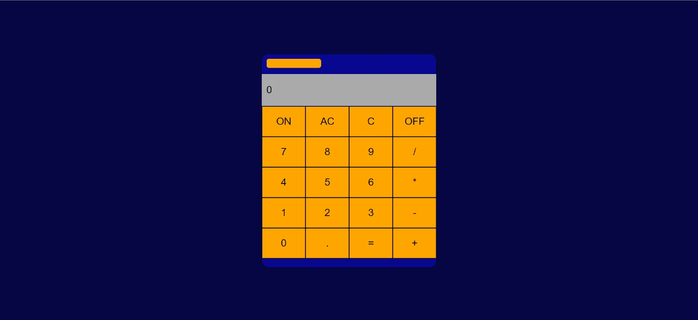

# Projeto Calculadora com React Js

## Scripts

### `npm start` - Iniciar aplicação
### `ctrl + c` - Para a aplicação

### O que é o ReactJs -

 `React Js é uma biblioteca JavaScript para a criação de interfaces de usuário.`

- Criado em 2011 pela equipe do Facebook, o React surgiu com o objetivo de otimizar a atualização e a sincronização de atividades simultâneas no feed de notícias da rede social, incluindo chat, status, listagem de contatos e outros..

### Projeto:

`O projeto consiste em criar uma calculadora realizando as principais operações matemática ( Soma, Divisão, Subtração e Multiplicação)`

